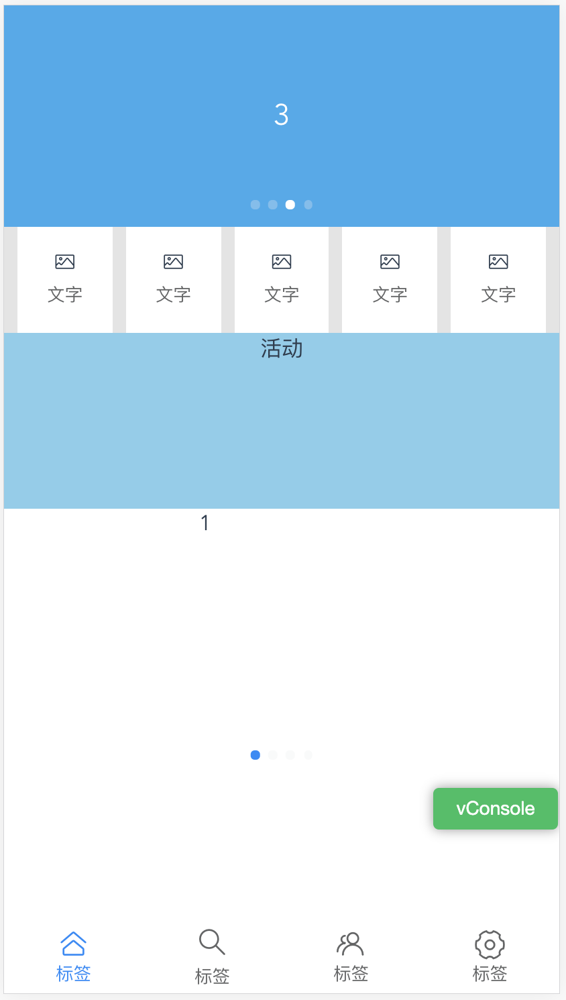

# vue3-mobile-app

## 初衷

本着学习的目的搭建的该项目，项目主要用于移动端，主要技术为 vue-next、vue-router@4.0.0、vuex@4.0.0、vite、axios、vant、viewport适配方案等构成。

为什么使用 vue3 呢？

- vite 重中之重
- composition API
- diff 算法优化
- 自带 typescript 支持
- 源码体积优化
- ……

## 爱之初体验

阐述完，vue3的相关优点之后，我们开始动手搭建自己的 mobile app 框架  

### 创建 vue-next 项目

- `npm init @vitejs/app`
- `npm install`
- 整合 vue-router `npm install vue-router@next`
- 整合 vuex `npm install vuex@next`
- 整合 vant `npm i vant@next -S`
- 整合 postcss-px-to-viewport 用于移动端自适应
- 整合 axios `npm install axios`
- 整合 vconsole 用于真机调试

详细步骤就不在这里展开了，可[点击这里了解详情](https://github.com/LeeJianQ/wapp/tree/master)

### 效果展示

### 优化相关

运行 `npm run build:dev` 命令，查看打包后文件，可以发现 vite 默认关闭 sourcemap, 那么生产环境构建时，无需关注这点、除非有特殊需求。  

接下只需要关注如何在 vite 开始 gzip 构建命令(是否需要？)

## 进阶 - 自定义插件

了解完基础的知识之后，再来了解一下进阶的用法，用于各种代码处理

### 插件执行顺序

执行顺序从上往下执行，相关钩子函数可在 [Rollup官网查看](https://rollupjs.org/guide/en/#plugin-development)  

- Alias
- 带有 enforce: 'pre' 的用户插件
- vite内置插件
- 没有 enforce 值的用户插件
- vite 构建用的插件
- 带有 enforce: 'post' 的用户插件